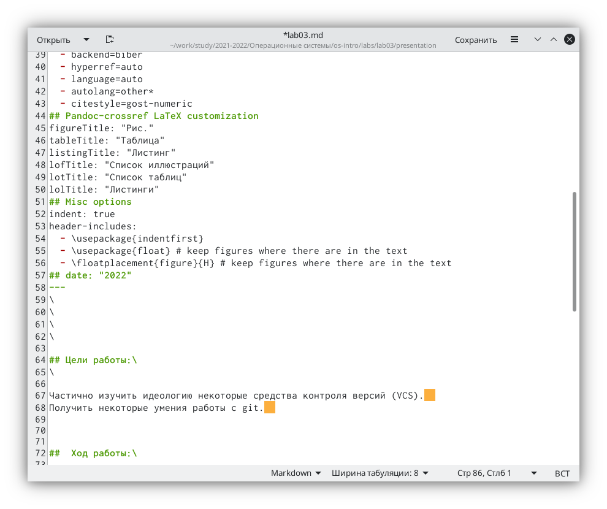

---
## Front matter
title: "Отчёт по третьей лабораторной работе"  
subtitle: "По дисциплине Операционные Системы "          
author: "Пупчин Сергей Константинович"
## Generic otions
lang: ru-RU
## Pdf output format
toc-depth: 2
fontsize: 12pt
linestretch: 1.5
papersize: a4
documentclass: scrreprt
## I18n polyglossia
polyglossia-lang:
  name: russian
  options:
	- spelling=modern
	- babelshorthands=true
polyglossia-otherlangs:
  name: english
## I18n babel
babel-lang: russian
babel-otherlangs: english
## Fonts
mainfont: PT Serif
romanfont: PT Serif
sansfont: PT Sans
monofont: PT Mono
mainfontoptions: Ligatures=TeX
romanfontoptions: Ligatures=TeX
sansfontoptions: Ligatures=TeX,Scale=MatchLowercase
monofontoptions: Scale=MatchLowercase,Scale=0.9
## Biblatex
biblatex: true
biblio-style: "gost-numeric"
biblatexoptions:
  - parentracker=true
  - backend=biber
  - hyperref=auto
  - language=auto
  - autolang=other*
  - citestyle=gost-numeric
## Pandoc-crossref LaTeX customizations
figureTitle: "Рис."
tableTitle: "Таблица"
listingTitle: "Листинг"
lofTitle: "Список иллюстраций"
lotTitle: "Список таблиц"
lolTitle: "Листинги"
## Misc options
indent: true
header-includes:
  - \usepackage{indentfirst}
  - \usepackage{float} # keep figures where there are in the text
  - \floatplacement{figure}{H} # keep figures where there are in the text
## date: "2022"
---
\
\
\
\

## Цели работы:\ 
\

Освоить основы легковесного языка разметки Markdown   
Переписать отчет по второй лабораторной с использованием Markdown  

##  Ход работы:\

Нам необходимо переделать отчет по предыдущей лабораторной работе.  
для этого мы создаем файл с разрешением md. 
после этого мы переписиваем отчет, заменяя заголовки на  
слова с '##', важные слова (таких не было) можно выделить при помощи '**'  
В целом все было довольно просто.  

  
рис 1 - начало документа  
\
\

Для того, чтобы посмотрть результат переписывания в формате docx  
необходимо ввести в терминал команду  
"pandoc lab03.md -o lab03.docx"  
другой вариант - воспользоваться готовой командой  make.  
\  
  
рис 2 создание файлов docx и pdf из файла с разрешением md  
\  
Для того, чтобы начать новую строку нужно вести два пробела  
для того, чтобы пропустить строку, необходимо напечатать косую черту  
\  

## Заключение\
Лично мне было непонятно как отцентровать текст и начать с новой страницы. Получил первый опыт работы в Markdown.  

