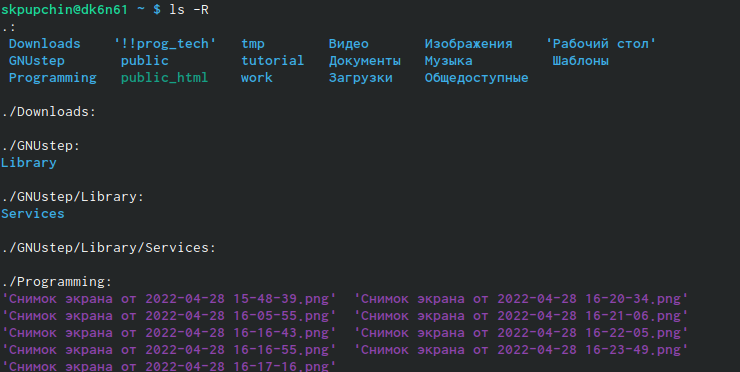
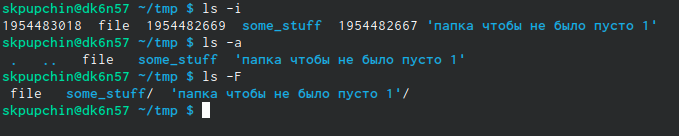
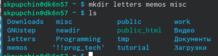
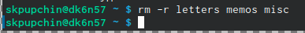
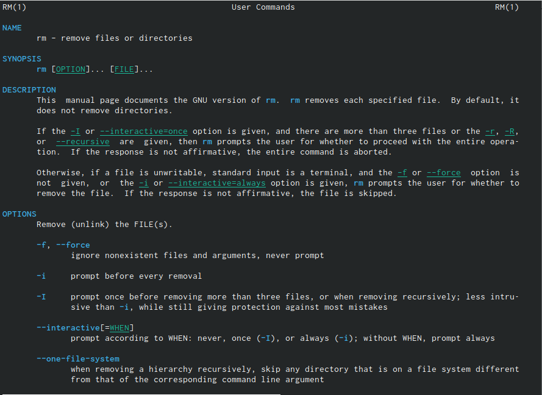
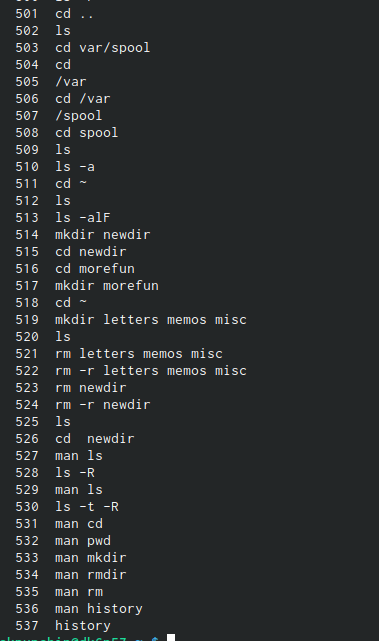
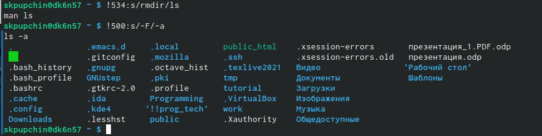

---
## Front matter
lang: ru-RU
title: Презентация про *четвертой* лабораторной
author: Pupchin Sergei
institute: RUDN University, Moscow, Russian Federation
## Formatting
toc: false
slide_level: 2
theme: metropolis
header-includes: 
 - \metroset{progressbar=frametitle,sectionpage=progressbar,numbering=fraction}
 - '\makeatletter'
 - '\beamer@ignorenonframefalse'
 - '\makeatother'
aspectratio: 43
section-titles: true
## Pandoc-crossref LaTeX customization
figureTitle: "Рис."
---

## Цели работы

- Получить навык взаимодействия с системой при помощи командной строки.  

{ #fig:001 width=70% }  

## Первый шаг

- Вывести полный пусть к домашнему каталогу при помощи команды pwd

- Перейти в каталог /tmp и вывести информацию о его содержимом 

{ #fig:002 width=70% } 

- Затем мы переходим в каталог /var/spool и при помощи команды ls проверяем наличие каталога cron.

## Создане и удаление некольких файлов одной командой

- Для этого мы перечисляем аргументы через запятую

{ #fig:003 width=70% }  

{ #fig:004 width=70% } 

## Получение подробной информации о командах

- При помощи команды man (от англ. мужык)
- При помощи ключа --help

{ #fig:005 width=70% }

## Просмотр истории

- При помощи команды history можно просмотреть историю команд

{ #fig:006 width=70% }

- Можно вызвать команду из истории с некоторыми изменениями при помощи команды  
!<номер_команды>:s/<что_меняем>/<на_что_меняем>

## Заключение

- Можно заключить, что я немного вспомнил, как пользоваться командной строкой: создавать и удалать файлы и каталоги, просматривать содержимое папок и получать подробную информацию о командах.

{ #fig:007 width=70% }

