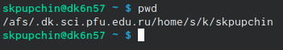
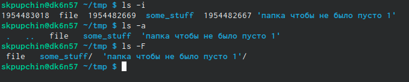
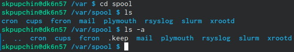
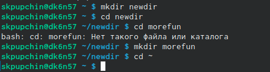
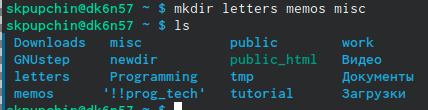
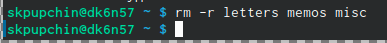
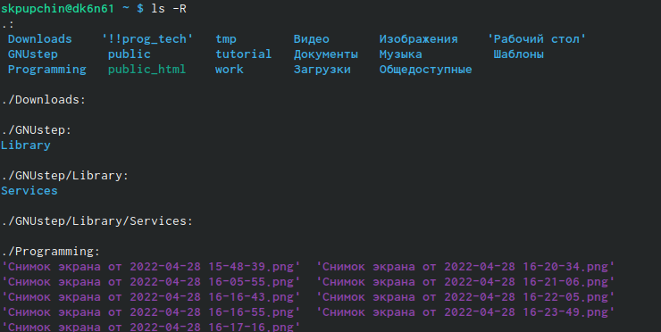
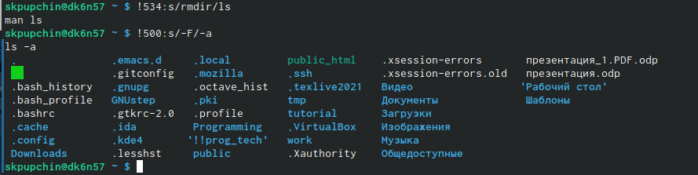

---
## Front matter
title: "Отчёт по четвертой лабораторной работе"  
subtitle: "По дисциплине Операционные Системы "          
author: "Пупчин Сергей Константинович"
## Generic otions
lang: ru-RU
## Pdf output format
toc-depth: 2
fontsize: 12pt
linestretch: 1.5
papersize: a4
documentclass: scrreprt
## I18n polyglossia
polyglossia-lang:
  name: russian
  options:
	- spelling=modern
	- babelshorthands=true
polyglossia-otherlangs:
  name: english
## I18n babel
babel-lang: russian
babel-otherlangs: english
## Fonts
mainfont: PT Serif
romanfont: PT Serif
sansfont: PT Sans
monofont: PT Mono
mainfontoptions: Ligatures=TeX
romanfontoptions: Ligatures=TeX
sansfontoptions: Ligatures=TeX,Scale=MatchLowercase
monofontoptions: Scale=MatchLowercase,Scale=0.9
## Biblatex
biblatex: true
biblio-style: "gost-numeric"
biblatexoptions:
  - parentracker=true
  - backend=biber
  - hyperref=auto
  - language=auto
  - autolang=other*
  - citestyle=gost-numeric
## Pandoc-crossref LaTeX customizations
figureTitle: "Рис."
tableTitle: "Таблица"
listingTitle: "Листинг"
lofTitle: "Список иллюстраций"
lotTitle: "Список таблиц"
lolTitle: "Листинги"
## Misc options
indent: true
header-includes:
  - \usepackage{indentfirst}
  - \usepackage{float} # keep figures where there are in the text
  - \floatplacement{figure}{H} # keep figures where there are in the text
## date: "2022"
---
\
\
\
\

## Цели работы:\ 
\

Получить навык взаимодействия с системой при помощи командной строки.  

##  Ход работы:\

Первое наше действие - вывод полного адреса домашнего каталога  

{ #fig:001 width=70% }  

После этого при помощи команды cd мы переходим в каталог /tmp  
и через команду ls c различными ключами мы выводим информацию о содержимом.  

{ #fig:002 width=70% }  

Затем мы переходим в каталог /var/spool и при помощи команды ls  
проверяем наличие каталога cron.  

{ #fig:003 width=70% }  

Затем мы создаем два новых каталога, newdir и morefun.  

{ #fig:004 width=70% }  

Наш следующий шаг - при помощи двух команд создать и удалить три каталога.  

{ #fig:005 width=70% }  

{ #fig:006 width=70% }  

Затем мы удаляем каталог newdir при помощи команды rm.  
Поскольку это каталог, необходимо добавить ключ -r.  

Потом при помощи команды man (от англ. мужык)  
мы узнали с какой опцыей команды ls можно вывесли содержание  
текущего каталога с подкаталогами.  

{ #fig:007 width=70% }  

Затем, с помощью той же комнады man мы получаем информацию о  
различных опциях команд cd, pwd, mkdir, rmdir и rm.  
Например опция --help выводит информацию о команде,  
а опция --version выводит информацию о версии.  
\

Заключительный шаг - при помощи команды history  
посмотреть историю введенных команд и поменять некоторые из них.  

{ #fig:008 width=70% }  
\
\

## Заключение\
Можно заключить, что я немного вспомнил, как пользоваться командной строкой: создавать и удалать файлы и каталоги, просматривать содержимое папок и получать подробную информацию о командах.  

