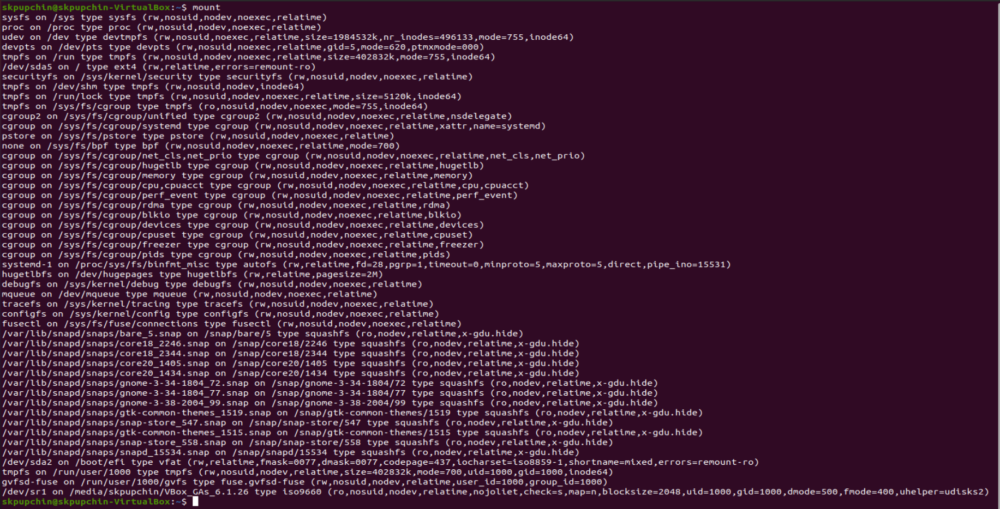
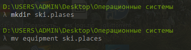
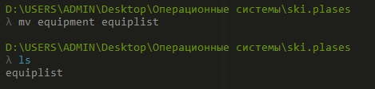
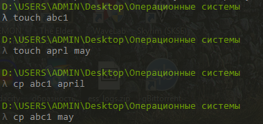
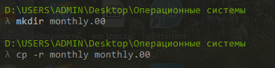
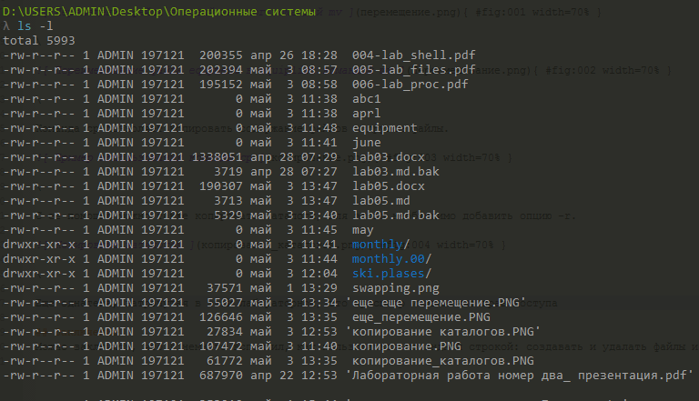
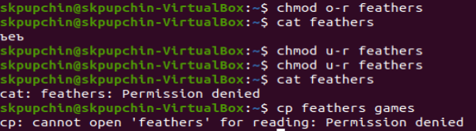
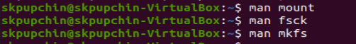

---
## Front matter
lang: ru-RU
title: Презентация по пятой лабораторной
author: Pupchin Sergei
institute: RUDN University, Moscow, Russian Federation
## Formatting
toc: false
slide_level: 2
theme: metropolis
header-includes: 
 - \metroset{progressbar=frametitle,sectionpage=progressbar,numbering=fraction}
 - '\makeatletter'
 - '\beamer@ignorenonframefalse'
 - '\makeatother'
aspectratio: 43
section-titles: true
## Pandoc-crossref LaTeX customization
figureTitle: "Рис."
---

## Цели работы

- Поучить практические навыки использования команд для работы
с файлами и каталогами, получить представление о файловой системе на линукс 

{ #fig:001 width=70% }  

## Выполнение примеров из описания лабораторной, команда mv

- при помощи команды mv можно преместить файлы в другой каталог или изменить их название

{ #fig:002 width=70% }  

{ #fig:003 width=70% } 

## Выполнение примеров из описания лабораторной, команда cp    

- Эта команда предназначениа для копирования файлов и каталогов

{ #fig:004 width=70% } 

{ #fig:005 width=70% }

## Изменение прав доступа

- Для того, чтобы просмотреть текущие права доступа к файлам можноввесли команду ls -l

{ #fig:006 width=70% }

- Для того, чтобы поменять права доступа, можно воспользоваться командой чмод

{ #fig:007 width=70% }

## Файловая система

- Команда mount выводит информацию о файловой системе. Команда fsck позволяет проверить целостноть систнмы файлов.
Комнанда kill модет прекратить процесс, который в настоящее время исполняется.

{ #fig:008 width=70% }

## Заключение

- Я получил опыт использования команд mv и cp, научился изменить права достпа через командную строку на линуксе.
Также я узнал про такие комнады, как mount, fsck, mkfs и kill.

