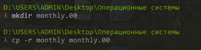

---
## Front matter
title: "Отчёт по четвертой лабораторной работе"  
subtitle: "По дисциплине Операционные Системы "          
author: "Пупчин Сергей Константинович"
## Generic otions
lang: ru-RU
## Pdf output format
toc-depth: 2
fontsize: 12pt
linestretch: 1.5
papersize: a4
documentclass: scrreprt
## I18n polyglossia
polyglossia-lang:
  name: russian
  options:
	- spelling=modern
	- babelshorthands=true
polyglossia-otherlangs:
  name: english
## I18n babel
babel-lang: russian
babel-otherlangs: english
## Fonts
mainfont: PT Serif
romanfont: PT Serif
sansfont: PT Sans
monofont: PT Mono
mainfontoptions: Ligatures=TeX
romanfontoptions: Ligatures=TeX
sansfontoptions: Ligatures=TeX,Scale=MatchLowercase
monofontoptions: Scale=MatchLowercase,Scale=0.9
## Biblatex
biblatex: true
biblio-style: "gost-numeric"
biblatexoptions:
  - parentracker=true
  - backend=biber
  - hyperref=auto
  - language=auto
  - autolang=other*
  - citestyle=gost-numeric
## Pandoc-crossref LaTeX customizations
figureTitle: "Рис."
tableTitle: "Таблица"
listingTitle: "Листинг"
lofTitle: "Список иллюстраций"
lotTitle: "Список таблиц"
lolTitle: "Листинги"
## Misc options
indent: true
header-includes:
  - \usepackage{indentfirst}
  - \usepackage{float} # keep figures where there are in the text
  - \floatplacement{figure}{H} # keep figures where there are in the text
## date: "2022"
---
\
\
\
\

## Цели работы:

Получение представления о файловой системе Linux, её структуре, именах и содержании
каталогов. Поучить практические навыков использования команд для работы
с файлами и каталогами, по управлению процессами (и работами), по проверке исполь-
зования диска и обслуживанию файловой системы.     
\

##  Ход работы:

Для начала нам необходимо выполнить примеры, приведенные в начале описания лабораторной работы. Эти примеры касаются 
команды копирования cp и команды премещения файла или каталога mv 

{ #fig:001 width=70% }  

\

{ #fig:002 width=70% }  

\

Команда cp позволяет копировать содержание файлов в другое файлы.

{ #fig:003 width=70% }  

\

С ее помощью можно также копировать каталоги, для этого необходимо добавить опцию -r.

{ #fig:004 width=70% }

\

Другая полезна команда - это команда cat, она позволет вывести содержание файла в командную строку.

{ #fig:005 width=70% }

Еще одна тема, затронутая в этой лабораторной, это просмотр и иземение прав доступа. Напомним, что, для того, 
чтобы просмотреть права доступа файлов в текущей папке необходимо ввести команду ls сключoм -l. 

{ #fig:006 width=70% }

\

Дла того, чтобы изменить права доступа, можно воспользоваться командной chmod. Формат этой команды таков: 
chmod режим имя_файла, для каждой группы пользователей 
(вледелец, пользователь и другие) может быть разрешено чтение, запись и исполнение. 
Режим можно вводить как в числовом формате, так и через символьную запись. Запрет на исполнение в случае 
каталогов запрещет в них перемещаться.

{ #fig:007 width=70% }

\

Запрет на чтение файлов запрещает просматривать их содержимое.

{ #fig:008 width=70% }

\
Команда mount выводит информацию о файлоdой системе. Команда fsck позволяет проверить целостноть систнмы файлов.
Комнанда kill модет "убить" процесс, который в настоящее время исполняется.  

\

## Заключение  
Я получил опыт использования команд mv и cp, научился изменить права достпа через командную строку на линуксе.
Также я узнал про такие комнады, как mount, fsck, mkfs и kill.

