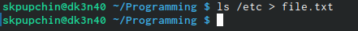
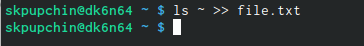
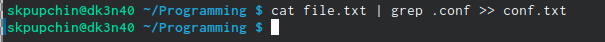
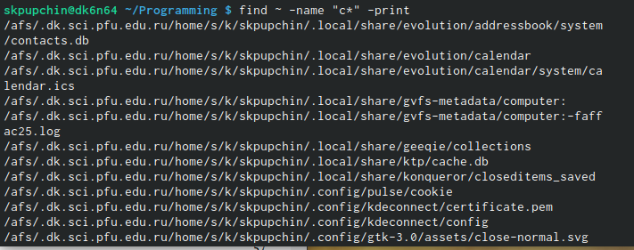
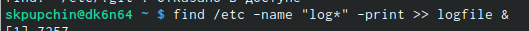
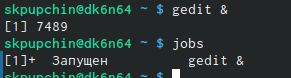
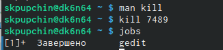
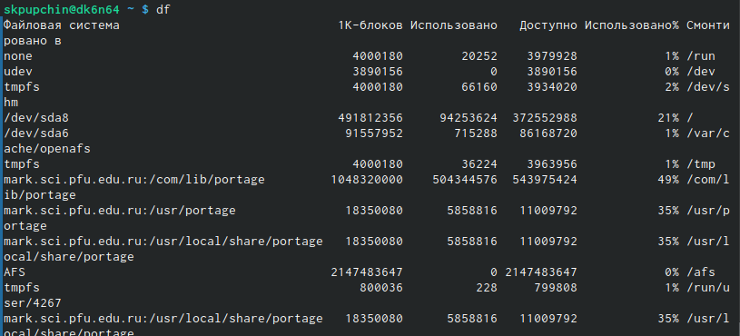
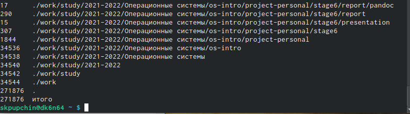

---
## Front matter
lang: ru-RU
title: Презентация по шестой лабораторной
author: Pupchin Sergei
institute: RUDN University, Moscow, Russian Federation
## Formatting
toc: false
slide_level: 2
theme: metropolis
header-includes: 
 - \metroset{progressbar=frametitle,sectionpage=progressbar,numbering=fraction}
 - '\makeatletter'
 - '\beamer@ignorenonframefalse'
 - '\makeatother'
aspectratio: 43
section-titles: true
## Pandoc-crossref LaTeX customization
figureTitle: "Рис."
---

## Цели работы

- Ознакомление с инструментами для нахождения файлов и фильтрации текста 
по разным параметрам, перенапрваления потоков ввода и вывода.   
Приобретение навыков по управлению процессами, по
проверке диска и обслуживанию файловых систем.  

## Использование файлового ввода-вывода

- Первое задание - записать в файл file.txt названия файлов в каталоге /ect. 
Для этого мы при помощи знака > перенаправляем вывод комнады ls /etc в файл file.txt.

{ #fig:001 width=70% }  

{ #fig:002 width=70% }  

## Использование конвеера

- конвеер позволяет передать выходные данные одной команды на вход другой команде

{ #fig:003 width=100% }  

- Также можно определить файлы в домашнем катаологе файлы, имена которых начинаются
с символа "c".

{ #fig:004 width=70% }  

## Запуск программ в фоновом режиме

- для того, чтобы запустить процесс в фоновом режиме, необходимо добавить знак &

{ #fig:006 width=70% }  

{ #fig:007 width=70% }  

## Убийство процессов

- Можно завершить процесс при помощи команды kill. Формат таков: kill n, где n - идентификатор процесса.

{ #fig:009 width=70% }  

## Просмотр информации о загруженности файловой системы

- Команда df показывает размер каждого смонтированного раздела диска.

{ #fig:010 width=70% }  

- Команда du показывает число килобайт, используемое каждым файлом или каталогом.

{ #fig:011 width=70% }  

## Заключение

- Я получил опыт работы с инструментами для нахождения файлов и фильтрации текста 
по разным параметрам, перенапрваления потоков ввода и вывода.   
Получил немного навыков управления процессами, по
проверке диска и обслуживанию файловых систем.  

