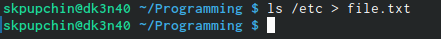
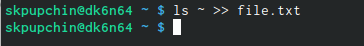
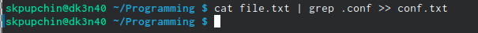
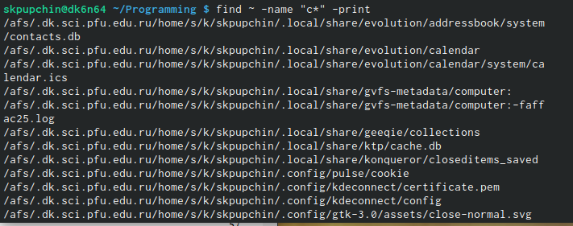
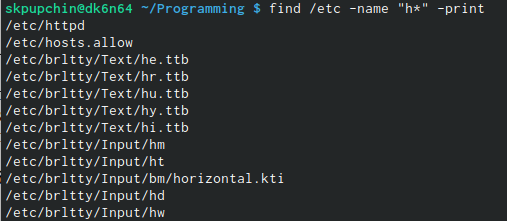
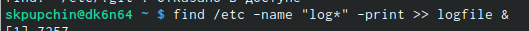
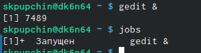
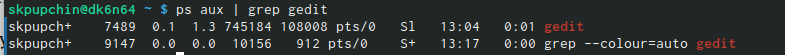
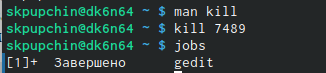
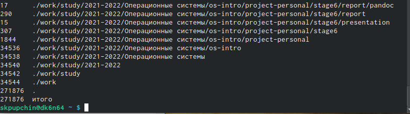

---
## Front matter
title: "Отчёт по шестой лабораторной работе"  
subtitle: "По дисциплине Операционные Системы "          
author: "Пупчин Сергей Константинович"
## Generic otions
lang: ru-RU
## Pdf output format
toc-depth: 2
fontsize: 12pt
linestretch: 1.5
papersize: a4
documentclass: scrreprt
## I18n polyglossia
polyglossia-lang:
  name: russian
  options:
	- spelling=modern
	- babelshorthands=true
polyglossia-otherlangs:
  name: english
## I18n babel
babel-lang: russian
babel-otherlangs: english
## Fonts
mainfont: PT Serif
romanfont: PT Serif
sansfont: PT Sans
monofont: PT Mono
mainfontoptions: Ligatures=TeX
romanfontoptions: Ligatures=TeX
sansfontoptions: Ligatures=TeX,Scale=MatchLowercase
monofontoptions: Scale=MatchLowercase,Scale=0.9
## Biblatex
biblatex: true
biblio-style: "gost-numeric"
biblatexoptions:
  - parentracker=true
  - backend=biber
  - hyperref=auto
  - language=auto
  - autolang=other*
  - citestyle=gost-numeric
## Pandoc-crossref LaTeX customizations
figureTitle: "Рис."
tableTitle: "Таблица"
listingTitle: "Листинг"
lofTitle: "Список иллюстраций"
lotTitle: "Список таблиц"
lolTitle: "Листинги"
## Misc options
indent: true
header-includes:
  - \usepackage{indentfirst}
  - \usepackage{float} # keep figures where there are in the text
  - \floatplacement{figure}{H} # keep figures where there are in the text
## date: "2022"
---
\
\
\
\

## Цели работы:

Ознакомление с инструментами для нахождения файлов и фильтрации текста 
по разным параметрам, перенапрваления потоков ввода и вывода.   
Приобретение навыков по управлению процессами, по
проверке диска и обслуживанию файловых систем.  
\

##  Ход работы:

Первый шаг - это, конечно же, внимательно прочтитать описание лабораторной и попробовать ввести описанные там команды.
Затем можно приступать к выполнению заданий. Первое задание - записать в файл file.txt названия файлов в каталоге /ect. 
Для этого мы при помощи знака > перенаправляем вывод комнады ls /etc в файл file.txt.

{ #fig:001 width=70% }  

\
Затем мы дописываем в этот файл имена всех файлов из домашнего каталога.

{ #fig:002 width=70% }  

\

После этого мы при помощи команды сat, конвеера и фильтра grep выводим из file.txt все файлы с расширением .conf в файл conf.txt.

{ #fig:003 width=70% }  

\
Следующий шаг - определить файлы в домашнем катаологе файлы, которые имеют имена, начинавшиеся
с символа "c".

{ #fig:004 width=70% }  

\
Еще мы аналогичным образом выводим на экран имена файлов из каталога /etc, начинающиеся
с символа h  

{ #fig:005 width=70% }  

\  

Если процесс занимает мого времени, его можно запустить в фоновом режиме дописав &.  

{ #fig:006 width=70% }  

\

Также из консоли можно запустить программу.  

{ #fig:007 width=70% }  

\

Просмотреть запущенные процессы можно при помощи команду jobs. Можно "выхватить" идентификатор процесса по его имени при помощи следующей комнады:  

{ #fig:008 width=70% }  

\

Можно завершить процесс при помощи команды kill. Формат таков: kill n, где n - идентификатор процесса.

{ #fig:009 width=70% }  

\
Команда df показывает размер каждого смонтированного раздела диска.

{ #fig:010 width=70% }  

\
Команда du показывает число килобайт, используемое каждым файлом или каталогом.

{ #fig:011 width=70% }  

## Заключение  
\  
Я получил опыт работы с инструментами для нахождения файлов и фильтрации текста 
по разным параметрам, перенапрваления потоков ввода и вывода.   
Получил немного навыков управления процессами, по
проверке диска и обслуживанию файловых систем.  

